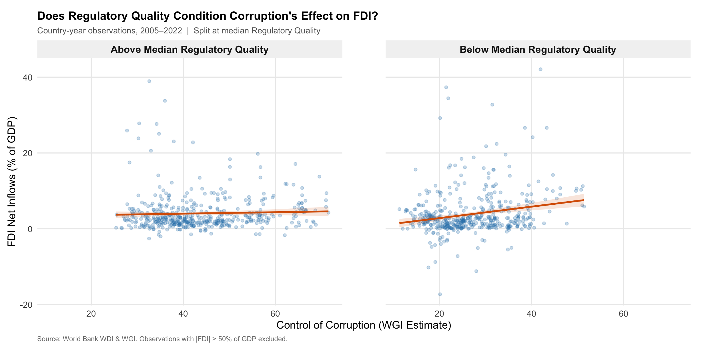
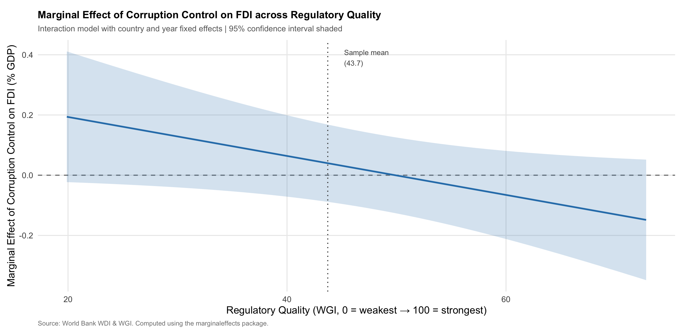

## Introduction

Despite decades of policy reform, Africa attracts a disproportionately small share of global foreign direct investment (FDI). Inflows reached an estimated \$59 billion in 2025, just over 3% of the global total for a continent accounting for roughly 18% of the world's population [@unctad2026]. While many factors contribute to this gap, understanding it requires grappling with a contested question at the heart of the institutional economics literature: does corruption inherently deter foreign investment, or can it sometimes facilitate it?

Historically, two mechanisms have pulled in opposite directions. The standard view treats corruption as a direct tax on investment: bribes and regulatory unpredictability raise effective entry costs, lower expected returns, and expose multinational firms to legal liability under home-country anti-bribery statutes. On this account, corruption should unambiguously reduce FDI, acting as "sand in the wheels" of the economy [@mauro1995; @wei2000]. However, a competing perspective — the "grease the wheels" hypothesis — argues that in environments where formal institutions are highly dysfunctional, corruption can help investors navigate bureaucratic obstacles, secure permits, and enforce informal agreements that courts cannot enforce. Under this logic, corruption might attract FDI precisely where formal governance fails most [@quazi2014].

The empirical literature increasingly suggests that the resolution to this debate lies in the broader institutional context. The key contribution of @meon2005 is to show that corruption's effects are not constant but depend heavily on the quality of surrounding institutions. However, this conditional relationship presents a theoretical fork in the road, offering two mutually exclusive stories for how regulatory quality interacts with corruption.

The first story is complementarity: higher regulatory quality reduces the harmful effects of corruption on FDI. In this scenario, investors use bribes to efficiently bypass the remaining inefficiencies in an otherwise functioning system. The second story is substitution: higher regulatory quality makes corruption *more* harmful to FDI. If a country has clear, functioning, and transparent market rules, investors do not need to pay bribes to get things done. In this strong regulatory environment, the "greasing" benefit of corruption disappears, and it acts strictly as a punitive, unpredictable tax that drives investors away.

While both stories have theoretical backing in the literature, existing research has not fully resolved which mechanism dominates in the African context. For instance, @benassy2007 found in a broad cross-country study that regulatory quality outperforms control of corruption as a predictor of FDI globally, but they do not directly test the continuous interaction between the two. Directly relevant is @lakha2024, who uses threshold regression across 34 African countries to show that corruption's deterrent effect on FDI emerges once governance falls below certain thresholds. Yet Lakha et al. examine discrete regime changes rather than a continuous moderating relationship, and they do not explicitly pit the complementarity and substitution mechanisms against one another.

This project addresses that gap by asking: Does regulatory quality mitigate the deterrent effect of corruption on FDI in Africa (complementarity), or does it exacerbate it by rendering corruption an unnecessary tax (substitution)? To answer this, we use a comprehensive panel dataset of 54 African countries over the period 2005–2022, drawn from the World Bank's World Development Indicators and Worldwide Governance Indicators. By employing a continuous interaction specification, this analysis does not pre-commit to a single theoretical outcome — it lets the data assess which mechanism dominates the realities of foreign investment in Africa. Understanding which mechanism is at play is critical not just for academic theory, but for policymakers attempting to sequence institutional reforms to attract global capital.

## Theory and Hypotheses

::: callout-note
**Note on variable coding:** The WGI "Control of Corruption" index is scaled so that higher values indicate stronger control  i.e., less corruption. Therefore, a positive baseline association means that reducing corruption increases FDI.
:::

Foreign direct investment is a long-horizon commitment. Firms acquire assets, build supply chains, and hire local workforces in anticipation of returns that materialize over years or decades. Because of this long time-horizon, investors are acutely sensitive not only to the immediate prevalence of corruption, but to the broader institutional matrix in which that corruption occurs.

The existing literature presents a theoretical fork in the road regarding how regulatory quality conditions the impact of corruption on investment. Rather than pre-committing to a single outcome, this analysis sets up a direct test between two plausible yet mutually exclusive relationships.

### The Complementarity Mechanism

The complementarity theory argues that good regulations and clean government amplify one another. Under this logic, formal market rules (regulatory quality) and the impartial enforcement of those rules (control of corruption) are both necessary to attract foreign capital.

If a country has high regulatory quality but officials remain highly corrupt, those excellent regulations are easily subverted by predatory bureaucrats. Conversely, if a government successfully eradicates corruption but leaves a paralyzing, dysfunctional regulatory framework in place, businesses will choke on the red tape because they can no longer bribe their way through it. Therefore, investors will only fully commit capital when both dimensions are strong. As @meon2005 notes, institutional weaknesses compound.

If complementarity holds, the positive effect of controlling corruption on FDI will be magnified in environments with good regulations.

> **H1a (Complementarity):** The positive association between corruption control and FDI inflows will be stronger in countries with higher regulatory quality, resulting in a positive interaction coefficient ($\hat{\beta}_3 > 0$).

### The Substitution Mechanism

The competing substitution theory argues that formal regulations and corruption act as functional substitutes for navigating a market. This aligns with the "grease the wheels" hypothesis.

When regulatory quality is abysmal, corruption serves a vital functional purpose: it allows firms to bypass paralyzing bureaucratic delays. If a government aggressively controls corruption in this low-regulation environment, it actually harms investment by removing the only viable workaround. However, when regulatory quality is high, formal channels work perfectly. The "need" to pay bribes completely disappears. In this strong regulatory environment, corruption ceases to be a useful tool and instead becomes a purely punitive, unpredictable tax that exposes multinational firms to severe home-country legal liabilities, such as the U.S. Foreign Corrupt Practices Act. Because good regulations substitute for the "grease" of corruption, the marginal benefit of improving corruption control is actually lower when regulations are already high-functioning.

If substitution holds, the positive effect of controlling corruption on FDI will diminish as regulatory quality improves, because the high-quality regulations are already doing the heavy lifting to attract investors.

> **H1b (Substitution):** The positive association between corruption control and FDI inflows will be weaker in countries with higher regulatory quality, resulting in a negative interaction coefficient ($\hat{\beta}_3 < 0$).

### Falsifiability and Placebo Testing

Testing H1a against H1b makes this research design explicitly falsifiable. The empirical results will demonstrate which mechanism dominates the African context. Furthermore, to demonstrate that this moderating effect is driven solely by market regulations and not merely a generic byproduct of "good governance", this study introduces a placebo test. If the interaction is truly about the operational mechanics of regulatory quality, then interacting corruption with a non-market governance dimension, such as Voice and Accountability, should yield a significantly weaker or statistically insignificant interaction term.

## Research Design

### Data

This analysis draws on two World Bank datasets merged into a balanced country-year panel covering 54 African countries over the period 2005–2022, yielding complete country-year observations across all regression variables.

The outcome variable, **FDI net inflows as a percentage of GDP**, comes from the World Development Indicators (WDI). Expressing FDI as a share of GDP normalizes for country size, making comparisons across the continent's highly heterogeneous economies meaningful. The two key institutional variables, **Control of Corruption** and **Regulatory Quality**, come from the Worldwide Governance Indicators (WGI), produced annually by the World Bank. Both are rescaled to run from approximately 0 (weakest governance) to 100 (strongest governance), so that higher values unambiguously indicate better institutions. The WGI draws on perception surveys of households, firms, and country experts, which introduces measurement error but offers the most consistent and comprehensive cross-country institutional data available for this time period.

Four covariates are included to control for confounders: **natural resource rents (% of GDP)**, which captures the resource-driven FDI common in Africa; **trade openness (% of GDP)**, which proxies for market integration; **political stability**, which controls for conflict and unrest; and **GDP per capita**, which accounts for market size and development level. All covariates are sourced from the WDI.

Table 1 presents summary statistics for the full analytical sample.

|                                   |   N |    Mean |      SD |    Min |      Max |
|-----------------------------------|----:|--------:|--------:|-------:|---------:|
| FDI Net Inflows (% of GDP)        | 938 |    4.35 |    7.68 | −17.29 |   103.34 |
| Regulatory Quality (WGI)          | 966 |   43.72 |    9.65 |  19.89 |    72.80 |
| Control of Corruption (WGI)       | 967 |   34.83 |   12.86 |   9.68 |    71.55 |
| Voice and Accountability (WGI)    | 966 |   45.43 |   12.39 |  15.52 |    73.81 |
| Natural Resource Rents (% of GDP) | 891 |   11.83 |   11.61 |   0.00 |    66.06 |
| Trade Openness (% of GDP)         | 836 |   72.44 |   40.90 |   2.70 |   347.72 |
| Political Stability (WGI)         | 966 |   55.19 |   14.86 |  13.76 |    87.83 |
| GDP per Capita (current US\$)     | 951 | 2548.55 | 3153.11 | 147.23 | 19141.51 |

: Summary Statistics — African Country-Year Panel, 2005–2022 {#tbl-summary}

*Source: World Bank WDI and WGI. WGI scores range from approximately 0 (weakest) to 100 (strongest governance).* \### Regression Specification

To test H1a against H1b, we estimate the following two-way fixed effects model:

$$
\text{FDI}_{it} = \beta_0 + \beta_1 \text{Corruption}_{it} + \beta_2 \text{RegQuality}_{it} + \beta_3 (\text{Corruption}_{it} \times \text{RegQuality}_{it}) + \gamma \mathbf{X}_{it} + \alpha_i + \delta_t + \varepsilon_{it}
$$

where $\alpha_i$ are country fixed effects, $\delta_t$ are year fixed effects, and $\mathbf{X}_{it}$ is the vector of covariates described above. Standard errors are clustered by country to account for within-country serial correlation.

The coefficient of primary interest is $\hat{\beta}_3$, the interaction term. A positive $\hat{\beta}_3$ supports H1a (complementarity); a negative $\hat{\beta}_3$ supports H1b (substitution). Note that $\hat{\beta}_1$ captures the association between corruption control and FDI when regulatory quality equals zero — the theoretical minimum of the WGI scale, not the sample mean (which is 43.72). Interpreting the main effect in isolation is therefore misleading; the marginal effects plot below provides the substantively meaningful picture.

Country fixed effects absorb all time-invariant country characteristics, such as geography, colonial history, and legal origins, that might jointly determine both governance and FDI. Year fixed effects absorb global shocks, such as the 2008 financial crisis and the COVID-19 pandemic, that affected FDI flows across continents.

### Threats to Inference

The primary threat to a causal interpretation is **reverse causality**: countries that attract more FDI may use the resulting tax revenues to invest in better institutions, generating upward bias in the corruption and regulatory quality coefficients. A second concern is **omitted variable bias** due to time-varying confounders not captured by the covariates, such as regional trade agreements or country-specific political transitions.

Country fixed effects partially address both threats by removing confounding from stable country-level characteristics. However, time-varying omitted variables remain a concern, and the coefficients should therefore be interpreted as conditional associations rather than causal effects.

## Findings

Figure 1 provides a descriptive overview of the bivariate relationship between governance and FDI across African countries.

The weak raw correlations in Figure 1 are consistent with neither governance dimension having a simple unconditional relationship with FDI across Africa. Resource-rich countries (orange triangles) are distributed across the full range of governance scores, suggesting that natural resource endowments do not systematically sort countries along either dimension. This motivates the interaction specification: governance may matter for FDI, but only under certain institutional conditions.

Figure 2 offers a first look at the interaction by splitting the sample at the median of regulatory quality (43.72). 
{width="100%" height="200%"}

The split-sample pattern in Figure 2 is instructive. Among countries with above-median regulatory quality, the relationship between corruption control and FDI is essentially flat — additional anti-corruption gains appear to deliver little marginal investment return where formal market institutions are already operative. Among countries with below-median regulatory quality, by contrast, corruption control is positively associated with FDI inflows, suggesting it functions as a partial substitute for the regulatory infrastructure those countries lack. This asymmetry constitutes preliminary visual support for H1b (substitution) over H1a (complementarity), and motivates the formal interaction test below.

The regression results are presented in Table 2, Column 1. The interaction coefficient β^3=−0.006\hat{\beta}_3 = -0.006
β^​3​=−0.006 (p<0.05p < 0.05
p<0.05) provides clear support for H1b (substitution), allowing us to reject H1a (complementarity). To interpret this magnitude concretely, consider two countries at the 25th and 75th percentiles of Regulatory Quality — approximately 37 and 51 on the 0–100 scale. At the 25th percentile, a ten-point improvement in corruption control is associated with a 1.0 percentage point increase in FDI as a share of GDP (marginal effect ≈ 0.10). At the 75th percentile, the marginal effect is approximately zero and may turn slightly negative — consistent with Figure 3, where the point estimate crosses the zero line around a regulatory quality score of 48–50. Anti-corruption gains therefore deliver substantially smaller, and eventually negligible, investment returns in already well-regulated environments, a difference that is economically meaningful given that the sample mean FDI share is just 4.35% of GDP.

|   | Main Model | Placebo: Voice | Placebo: Lagged | Placebo: Portfolio |
|----|:--:|:--:|:--:|:--:|
| Control of Corruption | 0.323\* | 0.217 |  | 0.071 |
|  | (0.167) | (0.157) |  | (0.200) |
| Control of Corruption (t−1) |  |  | 0.493\*\* |  |
|  |  |  | (0.194) |  |
| Regulatory Quality | 0.364\* |  |  | 0.111 |
|  | (0.184) |  |  | (0.217) |
| Regulatory Quality (t−1) |  |  | 0.368\*\* |  |
|  |  |  | (0.178) |  |
| Voice & Accountability |  | 0.007 |  |  |
|  |  | (0.130) |  |  |
| Corruption × Reg Quality | −0.006\*\* |  |  | −0.002 |
|  | (0.003) |  |  | (0.004) |
| Corruption × Voice & Acct |  | −0.003 |  |  |
|  |  | (0.003) |  |  |
| Corruption (t−1) × Reg Quality (t−1) |  |  | −0.009\*\* |  |
|  |  |  | (0.004) |  |
| Resource Rents (% GDP) | −0.084\* | −0.087\*\* | −0.092\*\* | −0.055 |
|  | (0.043) | (0.043) | (0.044) | (0.079) |
| Trade (% GDP) | 0.105\*\*\* | 0.102\*\*\* | 0.110\*\*\* | −0.017 |
|  | (0.031) | (0.031) | (0.031) | (0.011) |
| Political Stability | −0.039 | −0.014 | −0.021 | −0.049 |
|  | (0.040) | (0.035) | (0.040) | (0.048) |
| GDP per Capita | −0.000\*\*\* | −0.000\*\*\* | −0.000\*\*\* | −0.000 |
|  | (0.000) | (0.000) | (0.000) | (0.000) |
| Num. Obs. | 774 | 774 | 731 | 431 |
| R² | 0.497 | 0.495 | 0.516 | 0.225 |
| R² Adj. | 0.445 | 0.443 | 0.463 | 0.107 |
| FE: country | ✓ | ✓ | ✓ | ✓ |
| FE: year | ✓ | ✓ | ✓ | ✓ |

: Main Model and Placebo Tests {#tbl-regression}

\* p \< 0.1, \*\* p \< 0.05, \*\*\* p \< 0.01. Standard errors clustered by country in parentheses. Columns 1–3 use FDI (% GDP) as outcome; Column 4 uses portfolio equity (% GDP). To understand precisely where in the regulatory quality distribution the moderation effect is statistically operative, Figure 3 plots the marginal effect of corruption control on FDI across the full observed range of regulatory quality with 95% confidence intervals.

{width="100%"}

Figure 3 reveals important heterogeneity in where the substitution effect is statistically and substantively operative. At low levels of regulatory quality (around 20 on the WGI scale), the marginal effect of corruption control is positive — approximately 0.20 percentage points of FDI per GDP per unit improvement — but is estimated with considerable imprecision, with confidence intervals spanning zero. In institutionally weak environments, corruption control neither reliably attracts nor deters FDI, likely because the entire formal investment framework is sufficiently underdeveloped that marginal anti-corruption signals are insufficient to shift investor behaviour. As regulatory quality rises toward and above the sample mean (43.7), the point estimate declines monotonically, crossing zero around a score of 48–50 and turning statistically significant and negative at higher values, where the confidence band lies entirely below the zero line. It is precisely in Africa's better-governed economies — where investors are already operating through formal channels — that further anti-corruption progress is associated with reduced FDI inflows, plausibly because stricter enforcement removes informal flexibility without yet providing commensurate new formal assurances. Crucially, given that WGI indices are perception-based and therefore subject to classical measurement error, these estimates are likely attenuated toward zero, suggesting that the true substitution effect at high regulatory quality may be larger in magnitude than reported here.

## Empirical Extension

The main finding — that corruption control's association with FDI diminishes and eventually turns negative as regulatory quality improves — could reflect two alternative explanations that must be ruled out before the substitution interpretation can be sustained. First, the negative interaction might be a generic "good governance" effect, in which any pairing of institutional dimensions produces a similar moderating pattern simply because governance indices are correlated with one another. Second, the effect might be an artefact of the FDI measure itself: long-horizon foreign direct investment requires firms to physically embed in a host economy, navigating permits, contracts, and local workforces, and so may be uniquely sensitive to the regulatory–corruption nexus in ways that short-horizon financial flows are not.

**Placebo 1: Non-market governance (Voice and Accountability).**  Column 2 replaces Regulatory Quality with the WGI Voice and Accountability index, which captures political freedoms, civil liberties, and press freedom. Critically, this dimension has no direct bearing on permit issuance, contract enforcement, or market entry — the precise channels through which the substitution mechanism operates. The flat slope in Figure 2's above-median panel, and the zero-crossing in Figure 3, both implicate *market-operational* institutions specifically: environments where formal rules govern the day-to-day transaction costs of doing business. Voice and Accountability does not govern these transactions. If the Figure 3 pattern were simply a reflection of correlated governance indices rather than a specific institutional mechanism, the interaction with Voice and Accountability should be similarly signed and significant. It is not: the coefficient is −0.003 and statistically insignificant (p>0.1), approximately half the magnitude of the main interaction and indistinguishable from zero. This rules out a generic governance halo interpretation and anchors the finding to the market-operational channel.

**Placebo 2: Portfolio equity flows.** Column 4 replaces the dependent variable with portfolio equity inflows (% of GDP). Unlike FDI, portfolio investment involves the acquisition of listed financial assets rather than operational assets; portfolio investors do not build facilities, hire local management, or repeatedly engage with regulatory agencies. They are therefore largely insulated from the informal flexibility that the substitution mechanism posits: the progressive removal of that flexibility as regulatory quality improves — visible in Figure 3's declining marginal effect — should not register in their investment calculus. Consistent with this prediction, the interaction coefficient for portfolio flows is -0.002 and statistically insignificant, confirming that the pattern documented in Figures 2 and 3 is specific to investment modes that require sustained regulatory engagement.
Together, these tests triangulate the finding with precision: the substitution effect identified in Figure 3 is specific to a market-operational governance dimension rather than institutional quality in general, and to long-horizon investment rather than financial flows — exactly the combination the proposed mechanism requires. The placebo results also provide indirect reassurance that the correlated structure of WGI indices is not mechanically generating the main result.

**Lagged specification.** Column 3 re-estimates the main model with one-year lags on both governance variables. The sign, magnitude, and significance of the interaction term are nearly identical to those in Column 1, unsurprising given the high year-to-year persistence of WGI scores, which change slowly by design. The lagged model therefore largely reproduces the main result with a one-year offset rather than providing genuinely independent evidence. It is retained for completeness, but the two placebo tests, which vary the governance dimension and the outcome variable rather than timing, are the more informative robustness checks.

## Discussion and Policy Implications

This analysis finds consistent support for the substitution mechanism (H1b). In the African context, regulatory quality and corruption control function as institutional substitutes: as formal market institutions strengthen, the marginal investment return to anti-corruption progress declines, eventually turning negative among the continent's better-governed economies. Rather than resolving the "grease the wheels" versus "sand the wheels" debate unconditionally, the results suggest the answer is context-dependent — corruption control sands the wheels most where formal wheels already turn smoothly.
The two-way fixed effects design, lagged specification, and placebo tests collectively make it difficult to attribute this pattern to generic governance quality or short-horizon financial dynamics. Nevertheless, time-varying omitted variables cannot be ruled out, and the WGI's perception-based construction introduces classical measurement error that likely attenuates estimates toward zero — meaning the true substitution effect is probably larger than reported here. Results should be read as conservative conditional associations rather than clean causal identification.
The policy implications map directly onto the three regimes visible in Figure 3. For weak-regulatory states such as Chad or the Central African Republic, anti-corruption enforcement in isolation will not move investors; the priority is foundational regulatory infrastructure. For transition-zone economies around the sample mean, such as Kenya, Senegal, Tanzania coordinated reform is warranted: regulatory deepening and anti-corruption enforcement should advance together so that firms exiting informal channels find functioning formal alternatives. For better-governed economies such as Botswana, Mauritius, or Rwanda, the finding carries a counterintuitive warning: aggressive enforcement is associated with lower FDI, likely because investors lose informal flexibility before formal assurances materialise. Sequencing matters here, enforcement should be paired with explicit strengthening of investor protections and regulatory predictability.
Future research should pursue cleaner identification through historical institutional instruments or quasi-experimental shocks such as FATF grey-listing, and firm-level data to trace the mechanism to individual investment decisions.

------------------------------------------------------------------------

## References {.unnumbered}

::: {#refs}
:::
